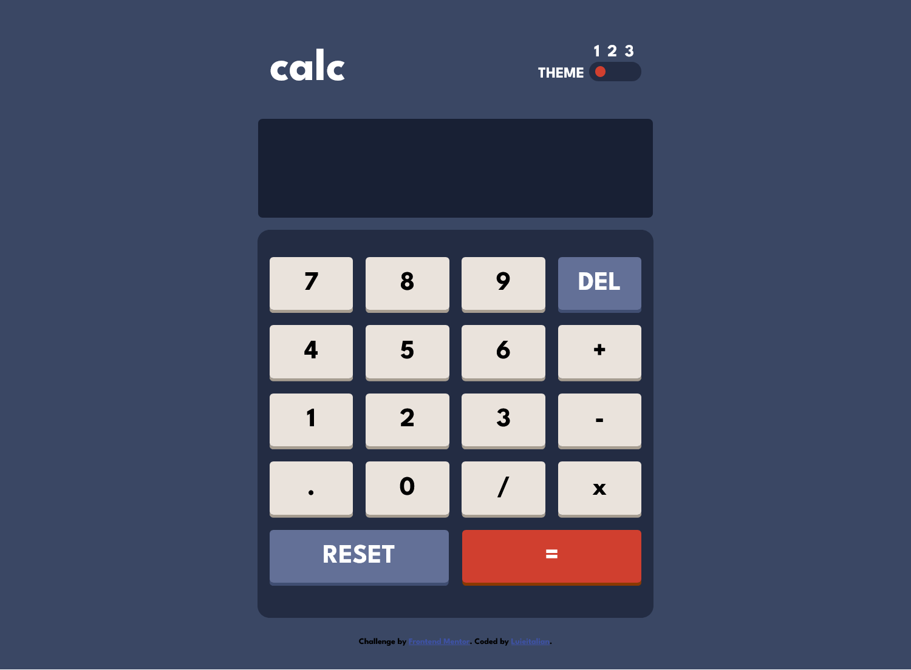

# Frontend Mentor - Calculator app solution

This is a solution to the [Calculator app challenge on Frontend Mentor](https://www.frontendmentor.io/challenges/calculator-app-9lteq5N29). Frontend Mentor challenges help you improve your coding skills by building realistic projects. 

### The challenge

Users should be able to:

- See the size of the elements adjust based on their device's screen size
- Perform mathmatical operations like addition, subtraction, multiplication, and division
- Adjust the color theme based on their preference
- **Bonus**: Have their initial theme preference checked using `prefers-color-scheme` and have any additional changes saved in the browser

## Screenshot
- There is layouts for Tablets, Desktops and Mobile devices.

### Links

- [Solution URL](https://your-solution-url.com)
- [Live Site URL](https://luieitalian.github.io/calculator-app-main/)

### Built with

- Semantic HTML5 markup
- Flexbox
- Mobile-first workflow
- [jQuery](https://jquery.com/) - JS library

## Useful resources

- [Switch Bar Styling](https://moderncss.dev/pure-css-custom-styled-radio-buttons/) - This resource helped me style radio inputs.
- [Calculator Algorithm](https://www.youtube.com/watch?v=wgBC-CUQEGs) - This video helped me so much coding the calculator. I also recommend this channel for ASMR purposes :P

## Author
- [Frontend Mentor](https://www.frontendmentor.io/profile/Luieitalian)
- [Twitter](https://www.twitter.com/luieitalian)

